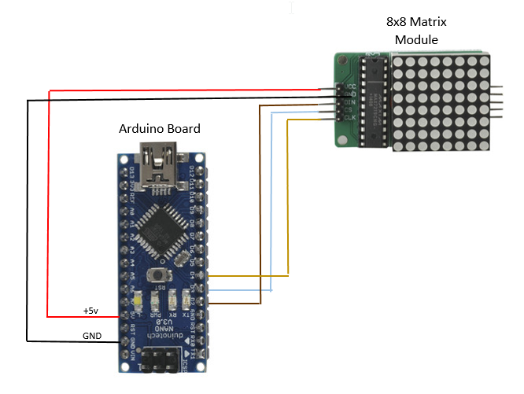
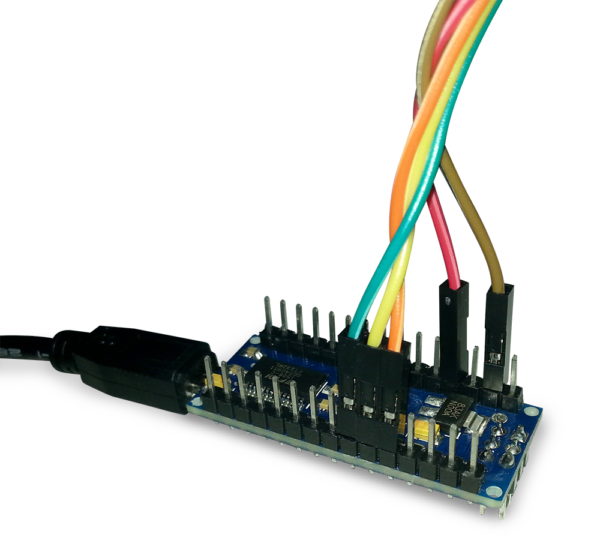
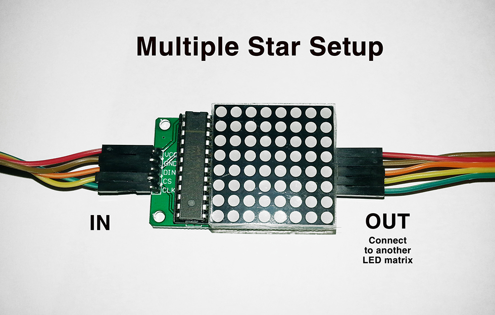
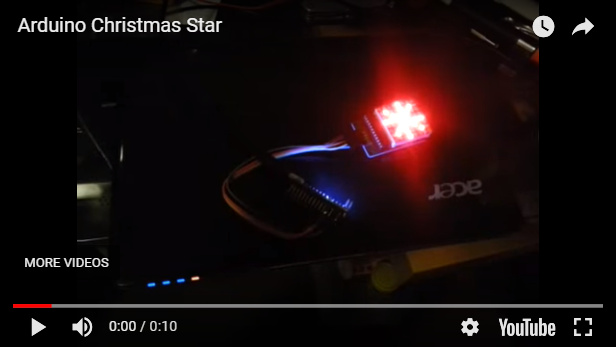

# Jaycar DIY Christmas Star
_Project 00010_

## Bill of Materials
| Qty | Code | Description |
| --- | --- | ---|
|1 | [XC4499](http://jaycar.com.au/p/XC4499) | Arduino compatible 8x8 LED Dot matrix
|1 | [XC4414](http://jaycar.com.au/p/XC4414) | Duinotech Nano
|1 | [WC7710](http://jaycar.com.au/p/WC7710) | USB A to Mini-B
|1 | [WC6026](http://jaycar.com.au/p/WC6026) | Socket to Socket Jumper leads

## Connection Table
| Nano | Matrix (IN) |
| --- | --- |
| 5V | VCC
| GND | GND|
|D2 | DIN |
|D3 | CS |
|D4 | CLK |

### Connection Diagram.

## Downloads
* [Source code](downloads/DIY-Christmas-Star.zip)

## Software Libraries
|Library | Author
| --- |

## Assembly
Simply make the connections as shown in the connection table.

 If more starts are wanted, connect the (OUT) side of the first star, to the (IN) side of the other.

## Programming
Download the source code and extract into a new folder, open the .ino file in the Arduino IDE and press upload.

If you want to change the star pattern, use the supplied excel sheet to generate the code for you to copy and paste into arduino.
## Use

Turn it on and enjoy!

## Future Improvements

* Print a 3D case for it.
